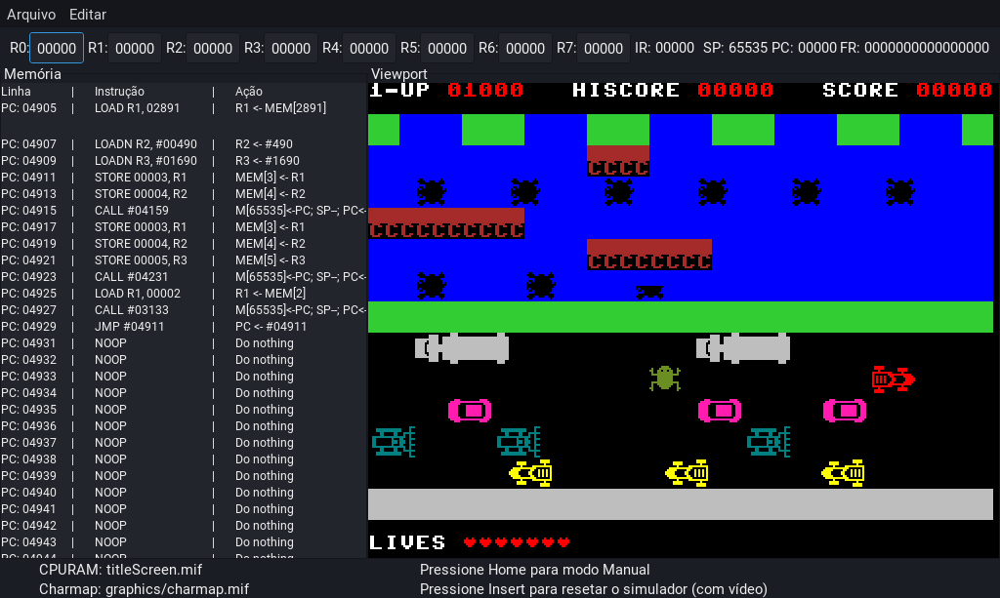

# Frogger demake

Implementação do jogo Frogger feita para o *processador do ICMC*, feita conforme exigência para aprovação na matéria de Prática em Organização e arquitetura de computadores.

## Sumário
- [Proposta projetual](#proposta_projetual)
- [Instruções para simulação](#instrucoes_para_simulacao)
- [Instruções para compilação](instrucoes_para_compilacao)

## Proposta projetual
Implementar em VHDL as instruções da linguagem de montagem para interação com o processador do ICMC para, com esta, criar um jogo apto a ser executado em placas FPGA modelo DE0-CV após compilação com o Sotware Quartus.

> **⚠ Atenção:** Na criação deste jogo foi necessária a extensão da capacidade de memória prevista para a RAM, de 32 a 64 KB. Por isso, a tempo de escrita deste documento não bastou  para executá-lo não bastará fazer uso dos simuladores  foi necessária a extensão da capacidade de memória tida para a RAM neste projeto,

## Instruções para simulação
